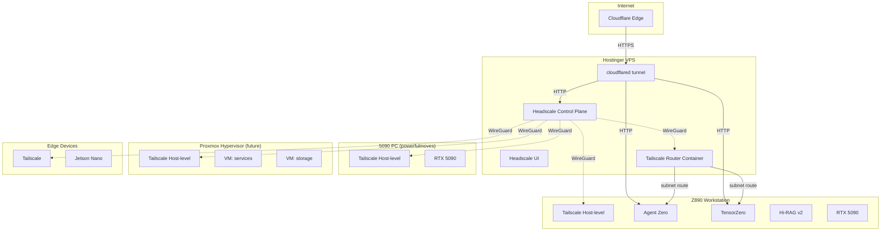

# PMOVES Network Fabric Architecture

## Overview

The PMOVES network fabric uses **Tailscale** (WireGuard mesh VPN) with an optional **Headscale** self-hosted control plane, fronted by **Cloudflare Tunnels** for public access.

## Topology



## Deployment Modes

| Target | Mode | Rationale |
|--------|------|-----------|
| Workstations (Z890, 5090) | Host-level | Every container gets tailnet access via host IP. Simplest for GPU workloads. |
| VPS (Hostinger) | Docker sidecar/subnet-router | VPS may restrict host installs. Container with `TS_USERSPACE=true` works without kernel modules. |
| Proxmox hypervisor | Host-level | Infrastructure layer. VMs/LXCs get optional individual identity. |
| Headscale control plane | Docker Compose | Self-hosted coordination server replacing Tailscale SaaS. |
| Edge devices | Host-level | Lightweight, direct install. |

## Traffic Flow

### Public Access (via Cloudflare)
```
User → headscale.pmoves.ai → CF Edge → CF Tunnel → VPS:cloudflared → headscale:8080
User → api.pmoves.ai → CF Edge → CF Tunnel → VPS:cloudflared → agent-zero:8080
```

### Inter-node (via Tailscale)
```
Z890 → WireGuard mesh → 5090  (direct, peer-to-peer)
Z890 → WireGuard mesh → VPS → Docker bridge → service
```

### Headscale Coordination
```
Node → headscale.pmoves.ai (HTTPS via CF) → Headscale → key exchange
Node ↔ Node (WireGuard, direct after coordination)
```

## ACL Policy

See `headscale/acl.hujson` for the full policy.

- **tag:pmoves** — base tag, all nodes can communicate
- **tag:workstation** — full access (dev machines)
- **tag:pmoves-vps** — can reach all pmoves nodes
- **tag:proxmox** — hypervisor, full access
- **tag:edge** — limited to pmoves-tagged hosts
- **tag:lab** — legacy compatibility

## Port Allocation

| Port | Service | Location |
|------|---------|----------|
| 8096 | Headscale API | VPS |
| 8196 | Headscale UI | VPS |
| 9190 | Headscale metrics | VPS |
| 41641 | WireGuard (Tailscale) | All nodes |

## Security

- WireGuard encryption for all inter-node traffic
- Cloudflare TLS termination for public endpoints
- ACL-enforced access control per tag
- Tailscale SSH eliminates need for traditional SSH key management
- Tailnet Lock signing for auth keys (when enabled)
- Sentinel files prevent accidental re-provisioning
